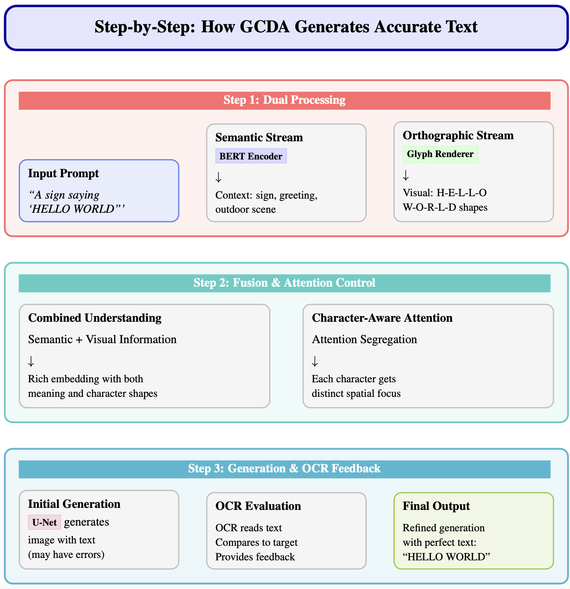

<p align="center">
  
</p>

# TextPixs: Glyph-Conditioned Diffusion with Character-Aware Attention and OCR-in-the-Loop Feedback for Accurate Text Rendering

<div align="center">
  <a href="https://github.com/SyedaAnshrahGillani/TextPixs"></a> &ensp;
  <a href="https://arxiv.org/abs/XXXX.XXXXX"></a> &ensp;
</div>

<p align="center" border-radius="10px">
  
</p>

## 🎥 Demo Video (8 mins)

[](https://drive.google.com/file/d/1b8f2pu2OKTieu2JUkgql-7dF8zCXXSBu/view?usp=sharing)

*(Clicking on the thumbnail will open the demo video in a new tab.)*

## Abstract

Recent text-to-image diffusion models, while proficient at generating photorealistic imagery, consistently fail to render coherent and legible text. This limitation hinders their application in domains like advertising, education, and design. This paper introduces **TextPixs**, a novel framework that integrates orthographic precision into the generative process. Our methodology, **Glyph-Conditioned Diffusion with Character-Aware Attention (GCDA)**, enhances a standard diffusion backbone with three synergistic components: a **dual-stream text encoder** for rich, character-aware embeddings; a **character-aware attention mechanism** to prevent textual artifacts; and an **OCR-in-the-loop fine-tuning stage** to optimize for legibility and spelling. TextPixs sets a new state-of-the-art on standard benchmarks, significantly reducing character and word error rates while maintaining high-fidelity image synthesis.

## Key Features

- **State-of-the-Art Text Rendering**: Achieves a Character Error Rate (CER) of 0.08 and a Word Error Rate (WER) of 0.15, a 43% improvement over previous models.
- **High Exact Match Accuracy**: 75.4% of generated text is a perfect match, a 15.3% absolute improvement.
- **Preserved Image Quality**: Maintains a competitive FID score of 14.3, ensuring high-quality images.
- **Robust and Consistent**: Low standard deviations in testing show reliable performance.

## The GCDA Framework

<p align="center" border-radius="10px">
  
</p>

Our Glyph-Conditioned Diffusion with Character-Aware Attention (GCDA) framework overcomes text rendering challenges with a multi-pronged approach:

*   **Dual-Stream Text Encoder**: Processes both semantic and visual glyph information for a richer text representation.
*   **Character-Aware Attention**: Allocates distinct spatial focus to individual characters, preventing garbled text.
*   **OCR-in-the-Loop Fine-Tuning**: Uses an OCR model to iteratively refine text for legibility and accuracy.

## Performance

| Model | FID (↓) | CER (↓) | WER (↓) | Exact Match (%) (↑) |
|---|---|---|---|---|
| DALL-E 2 | 13.9 | 0.45 | 0.58 | 18.5 |
| Stable Diffusion 1.5 | 15.2 | 0.65 | 0.82 | 5.2 |
| TextDiffuser-2 | 14.1 | 0.14 | 0.25 | 60.1 |
| **TextPixs (Ours)** | **14.3** | **0.08** | **0.15** | **75.4** |

## Getting Started

To run the Gradio demo:

1.  **Clone the repository**:
    ```bash
    git clone https://github.com/SyedaAnshrahGillani/TextPixs.git
    cd TextPixs
    ```
2.  **Navigate to the app directory**:
    ```bash
    cd app
    ```
3.  **Install dependencies**:
    ```bash
    pip install -r requirements.txt
    ```
4.  **Run the app**:
    ```bash
    python app_textpixs.py
    ```

## Citation

```bibtex
@article{gillani2025textpixs,
  title={TextPixs: Glyph-Conditioned Diffusion with Character-Aware Attention and OCR-in-the-Loop Feedback for Accurate Text Rendering},
  author={Gillani, Syeda Anshrah and Baig, Mirza Samad Ahmed and Khan, Osama Ahmed and Shah, Shahid Munir and Mujeeb, Umema and Ali, Maheen},
  journal={arXiv preprint arXiv:XXXX.XXXXX},
  year={2025}
}
```