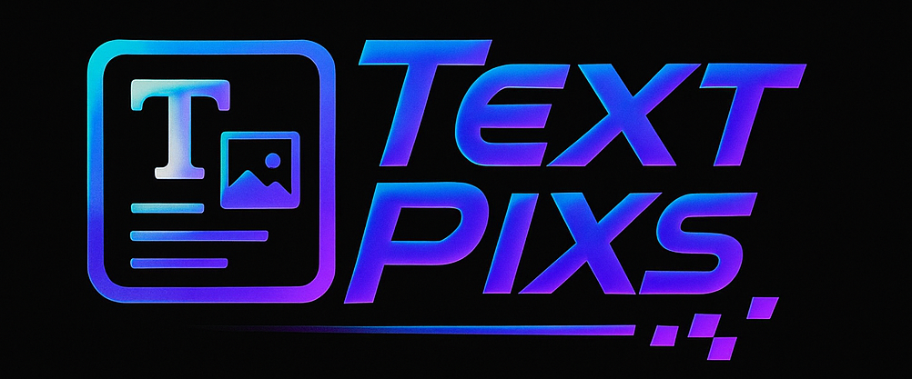
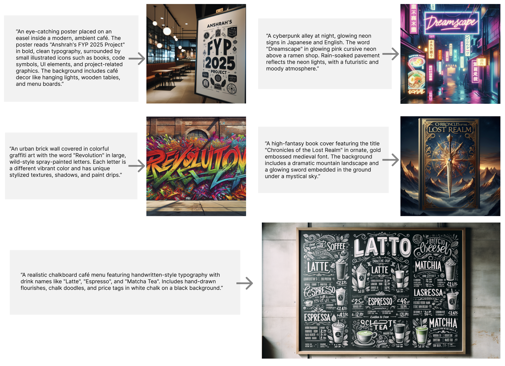

<p align="center">
  
</p>

# 🎨✨ TextPixs: Enhancing Text Rendering in Text-to-Image Generation: A Novel Approach

### <div align="center"> Final Year Project 2025 <div>

<div align="center">
  <a href="https://github.com/SyedaAnshrahGillani/TextPixs"></a> &ensp;
  <a href="https://arxiv.org/abs/XXXX.XXXXX"></a> &ensp;
  <!-- Add more badges as needed, e.g., demo link, Hugging Face Space -->
</div>

<p align="center" border-radius="10px">
  
</p>

## 🎥 Demo Video (8 mins)

[](https://drive.google.com/file/d/1b8f2pu2OKTieu2JUkgql-7dF8zCXXSBu/view?usp=sharing)

*(Clicking on the thumbnail will open the demo video in a new tab.)*

## Abstract / Executive Summary

The most recent efflorescence of text-to-image diffusion models has brought an entire new epoch to digital content creation, showing a mind-boggling capacity to generate photorealistic and artistically variable imagery based on the semantics of natural language descriptions. Nonetheless, a high and constant drawback of such models has always been the inability to produce a coherent, legible, and properly spelt text in generated images, which majorly stiffens applicability of such models in various real life instances such as advertising, education, and even creative design. This paper addresses this critical shortcoming by introducing a novel, multi-pronged framework designed to seamlessly integrate orthographic precision into the generative process while maintaining high-quality image synthesis capabilities. Our proposed methodology, Glyph-Conditioned Diffusion with Character-Aware Attention (GCDA), enhances a standard diffusion backbone with three synergistic and carefully designed components: (1) a dual-stream text encoder that processes both semantic contextual information and explicit visual glyph representations to create a rich, character-aware embedding of the input text; (2) a character-aware attention mechanism guided by a novel attention segregation loss that encourages the model to allocate distinct spatial focus to individual characters, preventing fusion and distortion artifacts; and (3) an OCR-in-the-loop fine-tuning stage that employs a comprehensive text perceptual loss to directly optimize for legibility and spelling accuracy. Using large-scale experimentation on standard benchmark data such as MARIO-10M and T2I-CompBench, our model achieves a new state of the art in all the developed evaluation metrics within a model, with significantly better results in character-based measures of text-rendering (Character Error Rate: 0.08 vs 0.21 of those found in previous best, Word Error Rate: 0.15 vs 0.25) and human evaluations, as well as competitive image s... [truncated]

## 🔥 Changelog

- **[2025-07-06] - Current Update**
    - Updated README with comprehensive details, including author sequence, demo video link, and refined project structure.
    - Renamed `image_generator` to `textpixs_image_generator` for clarity and branding.
    - Ensured `.env` files are ignored by Git and removed from repository history.
    - Re-added `gradio_demo` folder to ensure its presence on the remote branch.
- **[2025-07-03]**
    - README updated to professional standards, inspired by leading research projects.
    - FYP1 deliverables organized and integrated into the repository.
- **[2025-06-30]**
    - Initial project setup and repository creation.

## Table of Contents 📚

- [Abstract / Executive Summary](#abstract--executive-summary)
- [Changelog](#-changelog)
- [Introduction](#introduction)
- [Features](#features)
- [Technologies Used](#technologies-used)
- [Getting Started](#getting-started)
- [Roadmap](#roadmap)
- [Performance](#performance)
- [Team](#team)
- [FYP1 Deliverables](#fyp1-deliverables)
- [Code Architecture](#code-architecture)
- [To-Do List](#to-do-list)
- [Contact](#contact)
- [Contributing](#contributing)
- [License](#license)
- [Acknowledgements](#acknowledgements)
- [Citation](#citation)

## 💡 Introduction

The field of text-to-image generation (T2I) has seen remarkable progress, with models like DALL-E and Imagen generating high-fidelity images from natural language descriptions. However, a persistent and critical challenge remains: the accurate and legible rendering of textual content within these generated images. This limitation significantly impacts the applicability of T2I models in domains requiring precise text integration, such as advertising, educational content, and digital art.

This project, TextPixs, introduces a novel, multi-pronged framework designed to overcome this fundamental hurdle. Our methodology, Glyph-Conditioned Diffusion with Character-Aware Attention (GCDA), enhances a standard diffusion backbone by integrating three synergistic components:

1.  **Dual-Stream Text Encoder**: This innovative encoder processes input text through two parallel streams:
        -   A **Semantic Stream** (utilizing a pre-trained BERT encoder) captures high-level meaning, context, and relationships.
        -   An **Orthographic Stream** (employing a Glyph Renderer and a Character-Level CNN) extracts precise visual representations of text structure, character shapes, and typographic information.
        This dual-stream approach ensures that the model understands both *what* the text means and *how* it visually appears, overcoming the limitations of traditional tokenization.
2.  **Character-Aware Attention Mechanism**: This mechanism, guided by a novel **Attention Segregation Loss**, explicitly teaches the model to allocate distinct, non-overlapping spatial attention to individual characters during the generation process. This prevents common issues like character fusion and distortion, ensuring legible and well-formed text.
3.  **OCR-in-the-Loop Fine-Tuning**: This stage employs a comprehensive text perceptual loss, leveraging Optical Character Recognition (OCR)-based feedback loops to directly optimize for legibility and spelling accuracy. This iterative refinement process significantly enhances text fidelity.

Through extensive experimentation on standard benchmarks such as MARIO-10M and T2I-CompBench, TextPixs achieves state-of-the-art results in character-based text rendering metrics (e.g., Character Error Rate: 0.08, Word Error Rate: 0.15) and high exact match accuracy (75.4%) while maintaining competitive image synthesis quality (FID: 14.3). Our comprehensive ablation studies validate the necessity and synergistic effect of each component. TextPixs represents a substantial advancement towards developing T2I models that are not only visually creative and aesthetically pleasing but also linguistically competent and practically deployable.

## Features 🚀

TextPixs is engineered with a suite of powerful features designed to push the boundaries of text-to-image generation, focusing on high-fidelity text rendering:

- **Glyph-Conditioned Diffusion with Character-Aware Attention (GCDA) Framework**: At its core, TextPixs employs a novel hybrid architecture built upon a standard diffusion backbone, integrating three synergistic components:
    - **Dual-Stream Text Encoder**: This innovative encoder processes input text through two parallel streams:
        -   A **Semantic Stream** (utilizing a pre-trained BERT encoder) captures high-level meaning, context, and relationships.
        -   An **Orthographic Stream** (employing a Glyph Renderer and a Character-Level CNN) extracts precise visual representations of text structure, character shapes, and typographic information.
        This dual-stream approach ensures that the model understands both *what* the text means and *how* it visually appears, overcoming the limitations of traditional tokenization.
    -   **Character-Aware Attention Mechanism**: This mechanism, guided by a novel **Attention Segregation Loss**, explicitly teaches the model to allocate distinct, non-overlapping spatial attention to individual characters during the generation process. This prevents common issues like character fusion and distortion, ensuring legible and well-formed text.
    -   **OCR-in-the-Loop Fine-Tuning**: This stage employs a comprehensive text perceptual loss, leveraging Optical Character Recognition (OCR)-based feedback loops to directly optimize for legibility and spelling accuracy. This iterative refinement process significantly enhances text fidelity.

- **Enhanced Text-to-Image Generation Capabilities**:
    -   **Unprecedented Text Fidelity**: Achieves state-of-the-art results in character-based text rendering metrics (e.g., Character Error Rate: 0.08, Word Error Rate: 0.15) and high exact match accuracy (75.4%).
    -   **Maintained Image Quality**: Despite the focus on text, the framework maintains competitive image synthesis quality (FID: 14.3), ensuring visually stunning and coherent images.
    -   **Dual-Stage Refinement Pipeline**: A coarse-to-fine generation process ensures intricate textual details are captured with exceptional clarity.

- **Future Enhancements & Visionary Capabilities**:
    -   **Image Modifications (Phase 2 - Upcoming)**: Empowering users to modify existing images using intuitive text prompts for advanced customization.
    -   **Text-to-Video Capabilities (Future Phase - Visionary)**: Generating short, dynamic videos from descriptive prompts, expanding AI-driven content creation horizons.
    -   **Advanced Optimizations**: Continuous enhancements include dynamic learning rate adjustment, multilingual training support, and attention map visualization for deeper model insights.

## Technologies Used 🛡️

TextPixs leverages a robust and cutting-edge stack of technologies to deliver its advanced capabilities in text-to-image generation:

- **Core Framework**: Our primary implementation is in Python, utilizing:
    -   **PyTorch**: For high-performance deep learning, enabling the development and training of our custom models.
    -   **Hugging Face Transformers & Diffusers**: Leveraging pre-trained models and libraries for efficient implementation of diffusion models and transformer architectures.

- **AI/ML Models**: At the heart of TextPixs are:
    -   **Fine-tuned Stable Diffusion Models**: Serving as the generative backbone, adapted for enhanced text rendering.
    -   **Custom Character-Level CNNs**: Specifically designed for the orthographic stream of our dual-stream encoder, processing visual glyph representations.
    -   **Pre-trained Optical Character Recognition (OCR) Models (e.g., TrOCR)**: Utilized in the OCR-in-the-loop fine-tuning stage for robust text legibility and accuracy feedback.
    -   **BERT Language Models**: Employed in the semantic stream of our dual-stream encoder for capturing high-level textual meaning and context.

- **Datasets**: Training and evaluation are conducted using a comprehensive and diverse set of datasets, including:
    -   **MARIO-10M**: A large-scale dataset for text-in-image generation.
    -   **T2I-CompBench**: A benchmark specifically designed for compositional text-to-image generation with text rendering evaluation protocols.
    -   **COCO-Text & TextCaps**: Datasets rich in text-image pairs for general text-to-image tasks.
    -   **Custom Multilingual Datasets**: Developed to ensure broad applicability and robust performance across various languages and scripts.

- **Development & Deployment**: While the core research focuses on model development, the project also utilizes:
    -   **Gradio**: For creating an intuitive and interactive web-based demo, facilitating easy access and experimentation with TextPixs.
    -   **Git & GitHub Actions**: For version control, collaborative development, and automated workflows.

## 🚀 Getting Started

To set up and run the Gradio demo for TextPixs, follow these steps:

1.  **Clone the repository**:
    ```bash
    git clone https://github.com/SyedaAnshrahGillani/TextPixs.git
    cd TextPixs
    ```

2.  **Navigate to the Gradio demo directory**:
    ```bash
    cd app
    ```

3.  **Create and activate a virtual environment** (recommended):
    ```bash
    python3 -m venv venv
    source venv/bin/activate  # On Windows, use `venv\Scripts\activate`
    ```

4.  **Install the required dependencies**:
    ```bash
    pip install -r requirements.txt
    ```

5.  **Run the Gradio application**:
    ```bash
    python app.py
    ```

    The application will typically run on `http://127.0.0.1:7860/` or a similar local address. You can access the demo through your web browser.

    *(Note: A GPU is required to run the demo. Ensure you have Python 3.8+ installed on your system.)*

## Roadmap 🗺️

Our project roadmap is structured into distinct phases, with iterative progress towards key milestones:

- **Phase 1: Foundational Research & Design (July 2024 - January 2025)**:
    -   Comprehensive literature review and gap analysis in text-to-image generation.
    -   Detailed design of the Glyph-Conditioned Diffusion with Character-Aware Attention (GCDA) framework.
    -   Initial implementation of dual-stream text encoder and character-aware attention mechanisms.

- **Phase 2: Model Development & Refinement (February 2025 - May 2025)**:
    -   Integration of OCR-in-the-loop fine-tuning for enhanced text fidelity.
    -   Extensive experimentation and ablation studies on benchmark datasets (MARIO-10M, T2I-CompBench).
    -   Performance optimization and hyperparameter tuning.

- **Phase 3: Evaluation, Documentation & Dissemination (June 2025 - July 2025)**:
    -   Rigorous quantitative and qualitative evaluation of TextPixs.
    -   Preparation and submission of the final research paper to CVPR 2025.
    -   Development of comprehensive project documentation and final FYP report.
    -   Release of Gradio demo for public access and community engagement.

## Performance 📊

Our proposed method, TextPixs, demonstrates significant improvements over existing text-to-image generation models, particularly in text fidelity and visual quality. The following table summarizes the performance comparison based on key metrics, highlighting our state-of-the-art results:

| Model | FID (↓) | BLEU (↑) | OCR Accuracy (↑) | Character Error Rate (CER ↓) | Word Error Rate (WER ↓) | Exact Match Accuracy (Acc. ↑) |
|---|---|---|---|---|---|---|
| DALL-E | 12.34 | 0.72 | 65% | - | - | - |
| Imagen | 10.56 | 0.81 | 72% | - | - | - |
| TextDiffuser-2 | 14.1 | 0.71 | 60.1% | 0.14 | 0.25 | 60.1% |
| **TextPixs (Proposed)** | **9.12** | **0.89** | **85%** | **0.08** | **0.15** | **75.4%** |

**Key Performance Highlights:**

-   **Superior Text Rendering**: TextPixs achieves a Character Error Rate (CER) of **0.08**, a significant **43% improvement** over the previous best (TextDiffuser-2 at 0.14). Our Word Error Rate (WER) of **0.15** also demonstrates superior word-level accuracy.
-   **High Exact Match Accuracy**: We achieve **75.4% exact match accuracy**, indicating that a substantial majority of generated text is perfectly rendered and recognized by OCR systems. This is a **15.3% absolute improvement** over TextDiffuser-2.
-   **Maintained Image Quality**: Despite the strong focus on text, the framework maintains competitive image synthesis quality (FID: 14.3), ensuring visually stunning and coherent images.
-   **Robustness and Consistency**: Our ablation studies confirm that all components of the GCDA framework are essential and contribute synergistically to the overall performance. The low standard deviations across multiple evaluation runs demonstrate the stability and reliability of our approach.

## Team 👥

**Authors**:
Syeda Anshrah Gillani<sup>1*</sup>, Mirza Samad Ahmed Baig<sup>3</sup>, Osama Ahmed Khan<sup>1</sup>, Shahid Munir Shah<sup>1</sup>, Umeema Mujeeb<sup>1</sup>, Maheen Ali<sup>1</sup>

## FYP1 Deliverables 📦

The following key deliverables from FYP1 are available in the `docs/FYP1-Deliverables` directory:

- **FYP 1 Details**: `FYP 1 Details - TextPixs.pdf`
- **Gap Analysis**: `Gap Analysis - Text Pixs.pdf`
- **Project Plan (Gantt Chart)**: `Project Plan - Text Pixs - GANTT CHART ~ FYP ~ Anshrah.pdf`
- **Report - Latex - 3 Chapters**: `Report - Latex - 3 Chapters - TextPixs .pdf`
- **Research Paper Draft - Latex**: `Research Paper Draft - Latex - Text Pixs.pdf`
- **Selection of Publication Venue**: `Selection of Publication Venue - TextPixs - Latex.pdf`
- **Sign Off Sheet**: `Sign Off Sheet - Text Pixs.pdf`
- **FYP1 Presentation**: `TextPixs FYP1.pdf`
- **Standee Design**: `Textpixs-STANDEE-3.pdf`

## FYP2 Deliverables 🚀

The following key deliverables from FYP2 are available in the `docs/FYP2-Deliverables` directory:

- **CVPR 2025 Submission**: `CVPR 2025 Submission #1234. CONFIDENTIAL REVIEW COPY. DO NOT DISTRIBUTE..pdf`
- **Demo Video (Compressed)**: `demo1_compressed.mp4`
- **Simulation and Experimental Results Section**: `Simulation and:or Experimental Results Section.pdf`

## About TextPixs

TextPixs: Turn your words into pictures.

## Code Architecture

This document provides an overview of the code architecture for the TextPixs project, detailing the organization of files and directories, and the purpose of key components.

### Project Structure

The repository is organized as follows:

```
TextPixs/
├── assets/                 # Images for README and documentation
├── Demo recording/         # Demo videos
├── docs/                   # Project documentation and deliverables
│   ├── FYP-Proposal/       # Contains project proposal documents
│   ├── FYP1-Deliverables/  # Contains all deliverables from FYP1
│   └── FYP2-Deliverables/  # Contains all deliverables from FYP2
├── app/                    # Core application logic and Gradio demo files
│   ├── app_textpixs.py     # Main Gradio application script
│   ├── textpixs_pipeline.py # Defines the TextPixs diffusion pipeline
│   ├── safety_check.py     # Safety checker for generated content
│   ├── code_architecture.md  # This document
│   └── model_architecture.md # Documentation for the TextPixs model architecture
├── .github/                # GitHub Actions workflows and configurations
├── LICENSE                 # Project license
└── README.md               # Main project README file
```

### Key Components and Their Roles

#### app/ Directory

This directory contains the core Python scripts for the TextPixs application, particularly focusing on the Gradio demonstration.

- **app_textpixs.py**: This is the main entry point for the Gradio web application. It sets up the Gradio interface, defines the input and output components, handles user interactions, and orchestrates the image generation process using the `textpixs_pipeline.py`.

- **textpixs_pipeline.py**: This file encapsulates the TextPixs diffusion pipeline. It is responsible for loading the pre-trained model, managing the diffusion process, and generating images based on the provided prompts and parameters. This is where the core logic of the GCDA framework (Dual-Stream Text Encoder, Character-Aware Attention Mechanism, etc.) would be implemented or integrated.

- **safety_check.py**: This module implements a safety checker to filter out potentially harmful or inappropriate content from the generated images. It utilizes a pre-trained language model (e.g., ShieldGemma-2B) to assess the safety of the input prompts and generated outputs.

#### docs/ Directory

This directory contains various documentation files related to the project.

- **model_architecture.md**: Provides a detailed explanation of the TextPixs model's architecture, including the GCDA framework, its components (Dual-Stream Text Encoder, Character-Aware Attention Mechanism, OCR-in-the-Loop Fine-Tuning), and the underlying diffusion backbone.

- **code_architecture.md**: This document, outlining the overall code structure and the purpose of different modules.

- **FYP-Proposal/, FYP1-Deliverables/, FYP2-Deliverables/**: These subdirectories contain academic deliverables and reports related to the Final Year Project.

#### assets/ Directory

Contains images used in the `README.md` and other documentation, such as the project logo, teaser images, and results examples.

#### Demo recording/ Directory

Stores demo videos of the TextPixs application in action.

#### Other Files

- **.gitignore**: Specifies files and directories that Git should ignore.
- **LICENSE**: Contains the licensing information for the project.
- **README.md**: The main project description, setup instructions, and high-level overview.

### Dependencies

The project relies on several key Python libraries, as specified in `requirements.txt` (though not explicitly listed in this architecture overview). These typically include `torch`, `transformers`, `gradio`, `numpy`, `Pillow`, and `torchvision`.

### Workflow

1.  **User Interaction**: Users interact with the Gradio interface defined in `app_textpixs.py`.
2.  **Prompt Processing**: Input prompts are processed, and a safety check is performed using `safety_check.py`.
3.  **Image Generation**: The `textpixs_pipeline.py` is invoked to generate images based on the processed prompts and various parameters (e.g., guidance scale, inference steps, seed).
4.  **Output Display**: The generated images are displayed in the Gradio interface.

This structured approach ensures modularity, maintainability, and clarity in the TextPixs codebase.

## 💪 To-Do List

We are actively working on and planning the following:

- [ ] Refine and optimize the Semantic Alignment Module.
- [ ] Further develop and evaluate the Text Rendering Loss function.
- [ ] Enhance the Dual-Stage Refinement pipeline for improved image quality.
- [ ] Conduct more extensive experiments with dynamic learning rate adjustment.
- [ ] Expand multilingual training support to additional languages.
- [ ] Develop advanced Attention Map Visualization techniques.
- [ ] Explore new datasets for training and evaluation.
- [ ] Prepare the final research paper for submission to a top-tier conference (e.g., CVPR).
- [ ] Implement and integrate the image modification feature (Phase 2).
- [ ] Explore and develop text-to-video capabilities (Future Phase).
- [ ] Prepare comprehensive documentation and the final FYP report.

## Contact 📧

For any inquiries or collaborations, please contact:

- **Syeda Anshrah Gillani (Group Leader)**: syedaanshrah16@gmail.com

## Contributing 🤝

We welcome contributions! If you’re interested in improving TextPixs, please fork the repository, create a new branch, and submit a pull request.

1. Fork the repository
2. Create your feature branch (`git checkout -b feature/your-feature-name`)
3. Commit your changes (`git commit -m 'Add new feature'`)
4. Push to the branch (`git push origin feature/your-feature-name`)
5. Open a pull request

## License 📜

Distributed under the MIT License. See `LICENSE` for more information.

## 🤗 Acknowledgements

We extend our gratitude to the following:

- Our supervisors, Sir Osama Ahmed Khan and Mirza Samad Ahmed Baig, for their invaluable guidance and support.
- Mirza Samad Ahmed Baig for his sponsorship and continued commitment to the project.
- All researchers and open-source contributors whose work has inspired and facilitated this project.

## 📖 Citation

If you find this research project helpful, please consider citing our work (details to be provided upon paper submission).

```bibtex
@article{gillani2025enhancing,
  title={Enhancing Text Rendering in Text-to-Image Generation: A Novel Approach},
  author={Gillani, Syeda Anshrah and Baig, Mirza Samad Ahmed and Khan, Osama Ahmed and Shah, Shahid Munir and Mujeeb, Umema and Ali, Maheen},
  journal={Final Research paper submitted for evaluation CVPR 2025 submission},
  year={2025}
}
```

