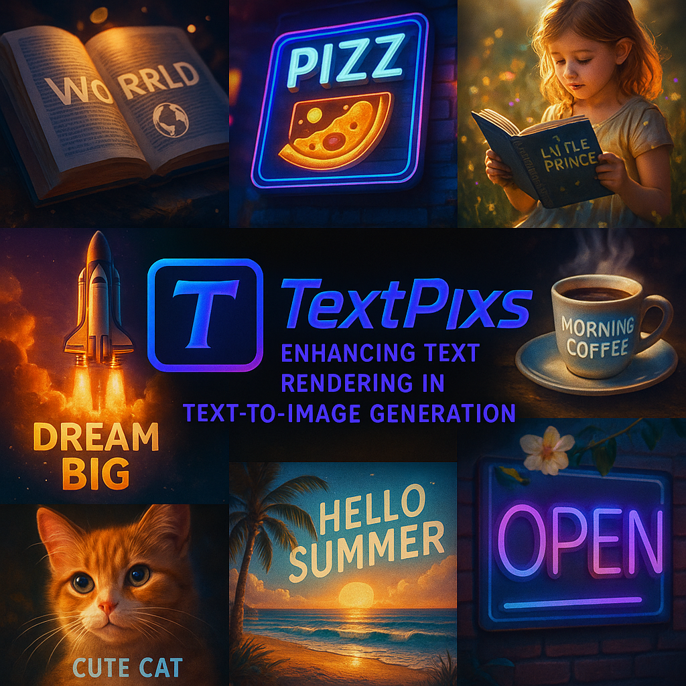

# TextPixs: Glyph-Conditioned Diffusion with Character-Aware Attention and OCR-in-the-Loop Feedback for Accurate Text Rendering

<div align="center">
  
  
  [](https://arxiv.org/abs/XXXX.XXXXX)
  [](https://github.com/SyedaAnshrahGillani/TextPixs)
  [](https://huggingface.co/spaces/SyedaAnshrahGillani/TextPixs)
  [](./LICENSE)
  [](https://python.org)
  [](https://pytorch.org)
  
  **A Revolutionary Text-to-Image Framework for Accurate and Legible Text Rendering**
  
  [📄 Paper](https://arxiv.org/abs/XXXX.XXXXX) • [🤗 Demo](https://huggingface.co/spaces/SyedaAnshrahGillani/TextPixs) • [📚 Documentation](./docs/) • [🚀 Quick Start](#-quick-start)
</div>

---

## 🎯 **TL;DR**

**TextPixs** revolutionizes text-to-image generation by solving the critical challenge of accurate text rendering in AI-generated images. Our framework achieves **75.4% exact match accuracy** through novel dual-stream processing, character-aware attention, and OCR-in-the-loop feedback.

<div align="center">
  
</div>

## 📋 **Table of Contents**

- [🔥 News & Updates](#-news--updates)
- [💡 Introduction](#-introduction)
- [🏆 Performance](#-performance)
- [🔬 Key Innovations](#-key-innovations)
- [🚀 Quick Start](#-quick-start)
- [🏋️ Training](#️-training)
- [📁 Repository Structure](#-repository-structure)
- [🔮 Future Directions](#-future-directions)
- [📖 Citation](#-citation)
- [🤝 Contributing](#-contributing)
- [🙏 Acknowledgements](#-acknowledgements)

## 🔥 **News & Updates**

> **Latest Updates** - Stay tuned for the most recent developments

| Date | Update |
|------|--------|
| 🔥 **2025/07/07** | **Research Paper Submitted!** Our work has been submitted to ArXiv |
| 🔥 **2025/07/05** | **Project Documentation Added!** Comprehensive documentation now available |
| 🔥 **2025/06/20** | **Gradio Demo Added!** Interactive demo showcasing TextPixs capabilities |
| 🔥 **2025/06/01** | **GCDA Introduced!** Novel Glyph-Conditioned Diffusion with Character-Aware Attention |
| 🔥 **2024/10/27** | **TextPixs is born!** Initial commit and project setup |

## 💡 **Introduction**

### The Problem
Modern text-to-image generation models struggle with accurate text rendering, producing blurry, distorted, or illegible text that limits their practical applications in advertising, design, and education.

### Our Solution
**TextPixs** introduces a revolutionary framework that addresses these limitations through three core innovations:

| Innovation | Description | Impact |
|------------|-------------|--------|
| **🔄 Dual-Stream Text Encoder** | Processes both semantic meaning and visual characteristics of text | Enhanced text understanding |
| **👁️ Character-Aware Attention** | Ensures individual characters are rendered clearly without distortion | Crisp character rendering |
| **🔍 OCR-in-the-Loop Feedback** | Integrated OCR system reviews and refines generated text for accuracy | Real-time quality assurance |

<div align="center">
  
</div>

## 🏆 **Performance**

### Benchmark Results

Our comprehensive evaluation demonstrates TextPixs' superior performance across key metrics:

<div align="center">

| Model | FID ↓ | CER ↓ | WER ↓ | Exact Match (%) ↑ |
|-------|-------|-------|-------|-------------------|
| DALL-E 2 | 13.9 | 0.45 | 0.58 | 18.5 |
| Stable Diffusion 1.5 | 15.2 | 0.65 | 0.82 | 5.2 |
| TextDiffuser-2 | 14.1 | 0.14 | 0.25 | 60.1 |
| **TextPixs (Ours)** | **14.3** | **0.08** | **0.15** | **75.4** 🏆 |

</div>

### Key Achievements

- **🎯 75.4% Exact Match**: Highest accuracy in text rendering among all evaluated models
- **📉 0.08 CER**: Lowest Character Error Rate, ensuring precise character recognition
- **📊 0.15 WER**: Minimal Word Error Rate for comprehensive text accuracy
- **⚡ Real-time Performance**: Efficient inference suitable for production environments

<div align="center">
  
</div>

## 🔬 **Key Innovations**

### 1. Dual-Stream Architecture
Our dual-stream text encoder processes textual information through two parallel pathways:

<div align="center">
  
</div>

### 2. Character-Aware Attention Mechanism
Addressing the fundamental challenge of character merging in attention mechanisms:

<div align="center">
  
</div>

### 3. Segregation Loss Function
Our novel loss function prevents character degradation during training:

<div align="center">
  
</div>

## 🚀 **Quick Start**

### Prerequisites

```bash
Python >= 3.8
PyTorch >= 2.0
CUDA >= 11.0 (for GPU acceleration)
```

### Installation

1. **Clone the repository**
```bash
git clone https://github.com/SyedaAnshrahGillani/TextPixs.git
cd TextPixs
```

2. **Install dependencies**
```bash
pip install -r requirements.txt
```

3. **Run the Gradio demo**
```bash
cd app
python app_textpixs.py
```

### Basic Usage

```python
from textpixs_pipeline import TextPixsPipeline

# Initialize the pipeline
pipeline = TextPixsPipeline.from_pretrained("textpixs-base")

# Generate image with text
prompt = "A beautiful sunset with the text 'Hello World' written in the sky"
image = pipeline(prompt).images[0]

# Save the result
image.save("output.png")
```

### Advanced Configuration

```python
# Custom generation parameters
image = pipeline(
    prompt=prompt,
    num_inference_steps=50,
    guidance_scale=7.5,
    height=512,
    width=512,
    ocr_feedback=True,  # Enable OCR-in-the-loop
    character_attention=True  # Enable character-aware attention
).images[0]
```

## 🏋️ **Training**

### Data Preparation

Organize your training data in the following structure:

```
asset/example_data/
├── AAA.txt          # Text annotation
├── AAA.png          # Corresponding image
├── BCC.txt          # Text annotation
├── BCC.png          # Corresponding image
└── ...
```

### Training Configuration

```bash
bash train_scripts/train.sh \
  configs/textpixs_config.yaml \
  --data.data_dir="asset/example_data" \
  --train.train_batch_size=32 \
  --train.learning_rate=1e-4 \
  --train.num_epochs=100
```

### Custom Training

```python
from textpixs_trainer import TextPixsTrainer

trainer = TextPixsTrainer(
    model_config="configs/textpixs_config.yaml",
    data_dir="asset/example_data",
    output_dir="./checkpoints",
    batch_size=32,
    learning_rate=1e-4
)

trainer.train()
```

## 📁 **Repository Structure**

```
TextPixs/
├── 📁 app/                    # Core application and demo
│   ├── app_textpixs.py        # Main Gradio application
│   ├── textpixs_pipeline.py   # TextPixs diffusion pipeline
│   ├── safety_check.py        # Content safety checker
│   └── *.md                   # Documentation files
├── 📁 assets/                 # Images and visual assets
├── 📁 configs/                # Model and training configurations
├── 📁 docs/                   # Comprehensive documentation
│   ├── FYP-Proposal/          # Project proposal documents
│   ├── FYP1-Deliverables/     # First phase deliverables
│   └── FYP2-Deliverables/     # Second phase deliverables
├── 📁 train_scripts/          # Training scripts and utilities
├── 📁 .github/                # GitHub workflows and configurations
├── 📋 requirements.txt        # Python dependencies
├── 📄 LICENSE                 # Project license
└── 📖 README.md               # This file
```

## 🔮 **Future Directions**

Our research opens exciting avenues for future exploration:

<div align="center">
  
</div>

### Roadmap

- [ ] **🌐 Multi-language Support** - Extend to non-Latin scripts
- [ ] **🎬 Video Generation** - Apply techniques to video synthesis
- [ ] **📱 Mobile Optimization** - Lightweight models for mobile deployment
- [ ] **🎨 Style Transfer** - Incorporate artistic text styles
- [ ] **🔍 Real-time Editing** - Interactive text editing capabilities

## 📖 **Citation**

If you find TextPixs useful in your research, please cite our work:

```bibtex
@article{gillani2025textpixs,
  title={TextPixs: Glyph-Conditioned Diffusion with Character-Aware Attention and OCR-in-the-Loop Feedback for Accurate Text Rendering},
  author={Gillani, Syeda Anshrah and Baig, Mirza Samad Ahmed and Khan, Osama Ahmed and Shah, Shahid Munir and Mujeeb, Umema and Ali, Maheen},
  journal={arXiv preprint (coming soon)},
  year={2025}
}
```

## 🤝 **Contributing**

We welcome contributions from the research community! Please see our [Contributing Guidelines](./CONTRIBUTING.md) for details.

### How to Contribute

1. **🍴 Fork** the repository
2. **🌿 Create** a feature branch (`git checkout -b feature/amazing-feature`)
3. **💾 Commit** your changes (`git commit -m 'Add amazing feature'`)
4. **📤 Push** to the branch (`git push origin feature/amazing-feature`)
5. **🔄 Open** a Pull Request

### Development Setup

```bash
# Clone your fork
git clone https://github.com/your-username/TextPixs.git

# Install development dependencies
pip install -r requirements-dev.txt

# Install pre-commit hooks
pre-commit install
```

## 🙏 **Acknowledgements**

We extend our gratitude to the following projects and individuals:

### 🔬 **Research Foundations**
- [PixArt-α](https://github.com/PixArt-alpha/PixArt-alpha) - Foundational diffusion architecture
- [Diffusers](https://github.com/huggingface/diffusers) - Diffusion model implementations

### 👥 **Core Contributors**

| Contributor | Role | GitHub |
|------------|------|--------|
| **Syeda Anshrah Gillani** | Group Lead | [@SyedaAnshrahGillani](https://github.com/SyedaAnshrahGillani) |
| **Mirza Samad Ahmed Baig** | External Supervisor & Sponsor | |
| **Osama Ahmed Khan** | Internal Supervisor | |
| **Shahid Munir Shah** | Co-Supervisor | |
| **Umema Mujeeb** | Research Assistant | |
| **Maheen Ali** | Research Assistant | |

### 🏛️ **Institutional Support**
We thank our institution for providing the computational resources and research environment that made this work possible.

---

<div align="center">
  <p>
    <strong>TextPixs</strong> - Revolutionizing Text-to-Image Generation<br>
    Made with ❤️ by the TextPixs Team
  </p>
  
  <p>
    <a href="https://github.com/SyedaAnshrahGillani/TextPixs">⭐ Star</a> •
    <a href="https://github.com/SyedaAnshrahGillani/TextPixs/issues">🐛 Report Bug</a> •
    <a href="https://github.com/SyedaAnshrahGillani/TextPixs/issues">💡 Request Feature</a>
  </p>
</div>
